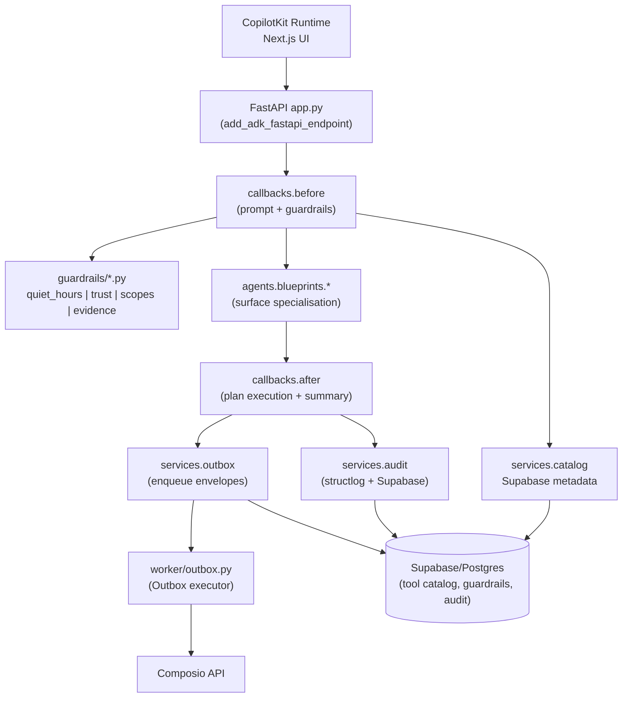

# Agent & Control Plane Architecture

**Status (October 6, 2025):** Implemented (FastAPI + control plane ADK agent +
in-memory catalog/outbox) · In progress (Supabase persistence, multi-employee
orchestration) · Planned (Outbox worker, observability surface)

This document explains how the Python control plane exposes agents over FastAPI today
and how we will evolve the package into a modular, service-oriented architecture. Treat
it as the source of truth for reviewers and implementers touching the agent runtime.

## 1. Current Deployment (demo stack)

- `agent/app.py` bootstraps `FastAPI`, loads settings via `pydantic-settings`, and
  mounts the control plane ADK agent at `/` using
  `ag_ui_adk.add_adk_fastapi_endpoint`.
- `agent/agents/control_plane.py` constructs the production-ready `LlmAgent` by wiring
  Composio-aware services, guardrails, and the desk blueprint.
- `agent/callbacks/before.py` and `agent/callbacks/after.py` provide deterministic
  hooks for prompt enrichment, guardrail evaluation, shared-state updates, and
  short-circuiting once an envelope is queued.
- Guardrail modules (`agent/guardrails/*.py`) evaluate quiet hours, trust thresholds,
  scope validation, and evidence expectations entirely in-memory; dependencies are
  injected via the callback builders so Supabase can slot in later.
- Services (`agent/services/*.py`) expose in-memory catalog, objectives, outbox, audit,
  and state helpers that match the contracts described below. Supabase-backed
  implementations will replace them in a future milestone.
- Health checks: `/healthz` returns `{"status": "ok"}` regardless of vendor SDK
  availability so deployments surface readiness even when optional integrations are
  offline.

This stack exercises the CopilotKit ↔ ADK bridge, guardrails, and Composio envelope
construction without requiring Supabase. Planned components must plug into this layout
without breaking the demo or unit tests.

## 2. Target Package Layout

```
agent/
 ├─ app.py                      # FastAPI wiring + settings bootstrap
 ├─ agents/
 │   ├─ control_plane.py        # Control plane agent wiring (implemented)
 │   ├─ coordinator.py          # Planned multi-employee orchestrator
 │   └─ blueprints/
 │       ├─ desk.py             # Desk surface prompt + state helpers (implemented)
 │       └─ approvals.py        # Planned approval-specialised blueprint
 ├─ callbacks/
 │   ├─ before.py               # Prompt synthesis + guardrail evaluation
 │   ├─ after.py                # Plan execution + transcript summary
 │   └─ guardrails.py           # Glue utilities shared by quiet_hours/trust/scopes
 ├─ guardrails/
 │   ├─ quiet_hours.py
 │   ├─ trust.py
 │   ├─ scopes.py
 │   └─ evidence.py
 ├─ services/
 │   ├─ settings.py             # pydantic Settings (implemented)
 │   ├─ state.py                # Shared-state helpers (implemented)
 │   ├─ catalog.py              # Supabase + Composio catalog adapters (implemented)
 │   ├─ objectives.py           # Supabase tenant objectives (implemented)
 │   ├─ outbox.py               # Supabase enqueue + DTO (implemented)
 │   ├─ audit.py                # structlog + Supabase writes (implemented)
 │   └─ supabase.py             # Supabase client helpers (implemented)
 └─ schemas/
     └─ envelope.py             # JSON contracts shared with UI/worker (implemented)
```

## 3. Control Plane Responsibilities



| Capability | Module(s) | Notes |
|------------|-----------|-------|
| FastAPI surface | `agent/app.py` | Hosts `/` (AGUI stream) and `/healthz`. Future `/metrics` must reuse the same app instance. |
| Agent orchestration | `agent/agents/*` | Compose blueprints, callbacks, and shared state per surface. Multi-employee coordination lives in `coordinator.py`. |
| Prompt & guardrail synthesis | `agent/callbacks/before.py`, `agent/guardrails/*` | Guardrail checks (`quiet_hours`, `trust`, `scopes`, `evidence`) run before the language model call and emit structured refusals. |
| Plan execution & summaries | `agent/callbacks/after.py` | Stream `StateDeltaEvent`s, short-circuit via `callback_context.end_invocation`, and summarise tool runs. |
| Settings & dependency injection | `agent/services/settings.py` | Provides `AppSettings`. Inject into services and callbacks to avoid global state. |
| Catalog & objectives | `agent/services/catalog.py`, `agent/services/objectives.py` | Supabase-backed services with explicit in-memory test doubles. |
| Outbox + audit | `agent/services/outbox.py`, `agent/services/audit.py` | Supabase queue + audit loggers (worker + agent share the same interfaces). |

## 4. Callback Pipeline Contract

Callbacks must stay deterministic and composable so we can layer guardrails without
side-effects:

1. `before_model_modifier` receives a `CallbackContext`. It should:
   - Merge tenant objectives and guardrail configs from `services.catalog/objectives`.
   - Run guardrail checks (quiet hours, trust, scopes, evidence). If any check fails,
     add a refusal response, log via `services.audit`, set
     `callback_context.end_invocation = True`, and return immediately.
   - Inject prompt augmentations (objectives, evidence summaries, autonomy thresholds).
   - populate shared state seeds (desk queue, approval modals) before the model call.

2. `after_model_modifier` is responsible for:
   - Inspecting tool responses and appending run summaries to shared state.
   - Emitting guardrail outcomes (allowed/blocked) for the UI (`guardrail-state.json`).
   - Enqueuing approved envelopes via `services.outbox`.
   - Ending the invocation once an envelope is emitted unless the plan requires further
     tool calls (set `end_invocation` accordingly).

3. Callbacks should never import FastAPI or database clients directly. All dependencies
   must be injected through the `CallbackContext`, `AppSettings`, or explicit function
   arguments. This keeps the pipeline easy to unit-test.

## 5. Service Layer Interfaces (implemented in-memory)

The service abstractions now ship with in-memory defaults so the control plane can run
without Supabase. Swap in Supabase-backed repositories once migrations and RLS policies
(`docs/architecture/data-roadmap.md`) are live.

```python
class CatalogService(Protocol):
    def get_tool(self, tenant_id: str, slug: str) -> ToolCatalogEntry: ...
    def list_tools(self, tenant_id: str) -> list[ToolCatalogEntry]: ...


class OutboxService(Protocol):
    def enqueue(self, envelope: Envelope, *, tenant_id: str) -> None: ...
    def mark_conflict(self, envelope_id: str, reason: str) -> None: ...


class AuditLogger(Protocol):
    def log_guardrail(self, *, tenant_id: str, name: str, allowed: bool, reason: str | None) -> None: ...
    def log_envelope(self, *, tenant_id: str, envelope_id: str, status: str) -> None: ...
```

The current implementation already uses these interfaces:

- `agent/services/catalog.py` exposes `InMemoryCatalogService` and a
  `ComposioCatalogService` that activates when Composio credentials are configured.
- `agent/services/outbox.py` queues envelopes in memory via `InMemoryOutboxService` and
  returns `OutboxRecord` instances consumed by the desk blueprint and tests.
- `agent/services/audit.py` ships a `StructlogAuditLogger` that tags guardrail and
  envelope events with tenant metadata.

## 6. Observability Expectations

- **Metrics (planned):** expose `/metrics` alongside `/healthz`. Minimum gauges:
  `agent_requests_total`, `guardrail_block_total`, `outbox_enqueue_total`,
  `shared_state_delta_total` (see `docs/references/observability.md`).
- **Logging:** use `structlog` with tenant IDs, envelope IDs, and guardrail names.
  Scrub PII before logging, referencing the policies in
  `docs/governance/security-and-guardrails.md`.
- **Tracing (planned):** wrap ADK callbacks in OpenTelemetry spans once the tracing
  stack is provisioned (`docs/operations/run-and-observe.md`).

## 7. Testing Expectations

- **Unit tests:** cover guardrail modules, catalog/outbox service shims, and callback
  helpers using fake `CallbackContext` objects. Mirror the fixtures in
  `libs_docs/adk/full_llm_docs.txt`.
- **Contract tests:** spin up the FastAPI app with stubbed services to ensure AGUI
  events stream correctly and guardrail refusals short-circuit invocations as expected.
- **Smoke tests:** `uv run python -m agent` combined with `pnpm dev:ui` should confirm
  `/healthz` returns `{"status": "ok"}` and the sidebar streams at least one
  `StateDeltaEvent`.

## 8. Roadmap & Next Steps

1. **Supabase implementations** – Replace the in-memory catalog, outbox, and audit
   services with Supabase-backed repositories while preserving the service interfaces.
2. **Add `/metrics` endpoint** – Reuse the FastAPI app instance, expose Prometheus
   metrics, and update `docs/operations/run-and-observe.md` once merged.
3. **Outbox worker** – Implement `worker/outbox.py` to dequeue envelopes, execute
   Composio actions with retries, and emit audit/telemetry events.
4. **Multi-employee orchestrator** – Incrementally build `agents/coordinator.py` to
   route work to specialised blueprints. Reference multi-agent patterns from
   `libs_docs/adk/full_llm_docs.txt`.

Update this file whenever a roadmap item lands. Each section should reflect the state of
the repository on the merge date so reviewers can map changes back to architecture
decisions quickly.
