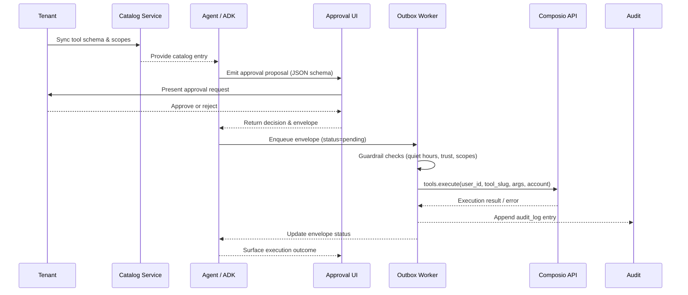

# Composio Execution Layer

**Status:** Implemented (Supabase catalog + Outbox worker) · In progress (connected account UX, telemetry)

ADR-0001 locks the platform to Composio as the only mechanism for executing actions on
third-party SaaS apps. This document provides the contract for implementing that
integration end-to-end.

## Responsibilities

1. **Catalog sync** – pull toolkits, schemas, scopes, and risk metadata per tenant.
2. **Connected account lifecycle** – initiate OAuth, poll for activation, disable, and
   re-authenticate accounts.
3. **Execution path** – enqueue, execute, and audit calls to `composio.tools.execute`.
4. **Observability** – capture telemetry (latency, success/failure, provider conflicts).

## Reference Material

- `libs_docs/composio_next/python/providers/google_adk/google_adk_demo.py` – example of
  requesting tools and running them inside an ADK agent via `GoogleAdkProvider` (mirrors
  the control plane wiring in `agent/agents/control_plane.py`).
- `libs_docs/composio_next/python/README.md` – SDK setup instructions, scopes glossary,
  and OAuth flow expectations.
- `libs_docs/adk/full_llm_docs.txt` – callback and guardrail composition patterns used by
  the control plane to short-circuit unsafe runs (`ctx.end_invocation = True`).
- `libs_docs/supabase/llms_docs.txt` – Supabase Cron + Edge Function patterns for
  catalog sync and telemetry fan-out.

## Proposed Flow

```
FastAPI Catalog Service (Supabase-backed)
 ├─ GET /tools → returns cached catalog entries per tenant
 ├─ POST /connected-accounts/initiate → returns OAuth URL (planned UI/API surface)
 └─ POST /connected-accounts/:id/enable|disable (planned)

Supabase Cron (recurring jobs)
 └─ Nightly job: composio.tools.get(...) → persist JSON schema + scopes in Supabase
    Configure via `cron.schedule()` to invoke an Edge Function that runs the catalog sync
    (pattern documented in `libs_docs/supabase/llms_docs.txt`).
    All recurring jobs managed via Supabase dashboard (Integrations → Cron) or SQL.
    Track cron definitions in `docs/operations/run-and-observe.md`.

Agent (google.adk)
 ├─ Discovers tool metadata from catalog
 ├─ Includes required scopes in proposals (adds to desk shared state)
 └─ Produces envelope → Outbox

Outbox Worker (`worker/outbox.py`)
 ├─ Pops envelope, checks guardrails (quiet hours, trust, DNC)
 ├─ Calls composio.tools.execute(user_id, tool_slug, args, connected_account_id)
 └─ Persists outcome + latency + conflict flags (Supabase `outbox` + `outbox_dlq` tables)

UI
 ├─ Displays schema-driven edit forms using cached JSON schema (Desk surface today,
    Approvals modal planned)
 └─ Shows execution result and audit trail (via `StateDeltaEvent`s and audit log entries)
```

### Sequence Overview



## AI-Enhanced Execution Context

Supabase's built-in AI capabilities enable intelligent context injection and evidence
retrieval before tool execution:

1. **Semantic evidence retrieval** – before executing a tool, query `evidence_embeddings`
   using vector similarity to inject relevant historical context, past outcomes, or
   related signals into the agent prompt.
2. **Embedding tool outputs** – after successful execution, generate embeddings for tool
   outputs and persist them in `evidence_embeddings` for future semantic search.
3. **Smart retry logic** – use embedding-based similarity to identify past failures with
   similar contexts and adjust retry strategies accordingly.
4. **Catalog augmentation** – store tool descriptions as embeddings to enable semantic
   tool discovery (e.g., "find a tool that sends notifications").

Edge Functions with the built-in `gte-small` model can generate embeddings synchronously
without external API calls, keeping latency low and reducing dependencies. Reference
`libs_docs/supabase/llms_docs.txt` (lines 48117–48230) for implementation patterns and
`docs/architecture/data-roadmap.md` for how embeddings feed shared state.

### Supabase Integration Summary

- **Vector store** – persist execution metadata in `evidence_embeddings` using pgvector;
  query prior to execution to augment prompts.
- **Realtime** – publish envelope status changes to `outbox:tenant_id` so the frontend
  can reflect in-flight executions instantly.
- **REST/RPC** – expose a read-only REST view (`pending_outbox_view`) that filters by
  tenant. The UI and external observers can introspect queue state without touching the
  primary worker database connection.
- **Edge Functions** – use Edge Functions for Composio webhooks (connected account
  status) and to mediate catalog sync tasks triggered by Supabase Cron.
- **Storage** – upload large tool responses or evidence artifacts to Supabase Storage and
  link them from `audit_log.payload`. This avoids bloating the Postgres row size while
  keeping artefacts auditable.

## Implementation Checklist

1. **Client bootstrap** – wrap `Composio(provider=GoogleAdkProvider())` in a singleton
   service. Ensure `COMPOSIO_API_KEY` is read from settings.
2. **Catalog persistence** – define Supabase tables for toolkits, tool versions, default
   risk tiers, and connected accounts. Include unique constraints on `(tenant_id, slug)`.
3. **Envelope format** – finalise a JSON structure with:
 ```json
  {
    "tool_slug": "GITHUB__issues.create",
    "args": {...},
    "connected_account_id": "ca_123",
    "risk": "low",
    "trust_context": {...},
    "external_id": "uuid"  // for idempotency
  }
  ```
4. **Execution + retries** – use Tenacity with exponential backoff. Conflicts (409)
   should mark the envelope as `conflict` but not retry per Composio guidance.
5. **Audit trail** – log every attempt with request/response payload (PII scrubbed) in
   the audit table. Surface the latest status in the Activity timeline.
6. **REST exposure** – create PostgREST views for `outbox_pending`, `outbox_history`, and
   `catalog_tools` with RLS policies that scope data per tenant. Document which views the
   UI consumes so on-call engineers understand external dependencies.
7. **Safety gates** – enforce quiet hours, autonomy thresholds, and scope validation
   before executing. These align with `docs/governance/security-and-guardrails.md`.

### Approval Flow Contract

- Catalog sync writes JSON Schemas to `tool_catalog.schema`. UI surfaces render those
  via the approval scaffolds documented in `docs/implementation/ui-surfaces.md` and the
  shared state contract (`docs/implementation/frontend-shared-state.md`). Payloads must
  conform to `docs/schemas/approval-modal.json` (no additional properties).
- Scope upgrade envelope example:

  ```json
  {
    "envelopeId": "env_123",
    "proposal": {
      "summary": "Request calendar scope upgrade",
      "evidence": [
        "CALENDAR.READ required to sync events",
        "CALENDAR.WRITE needed to update meetings"
      ]
    },
    "requiredScopes": ["CALENDAR.READ", "CALENDAR.WRITE"],
    "approvalState": "pending"
  }
  ```

- Evidence prompt envelope example:

  ```json
  {
    "envelopeId": "env_456",
    "proposal": {
      "summary": "Submit expense report",
      "evidence": [
        "Upload expense receipt",
        "Confirm policy clause"
      ]
    },
    "requiredScopes": [],
    "approvalState": "pending"
  }
  ```

Ensure callback and UI code stay aligned with this contract so approvals can be
rendered without bespoke React components.

Document progress by updating the status header above as you land each milestone.
