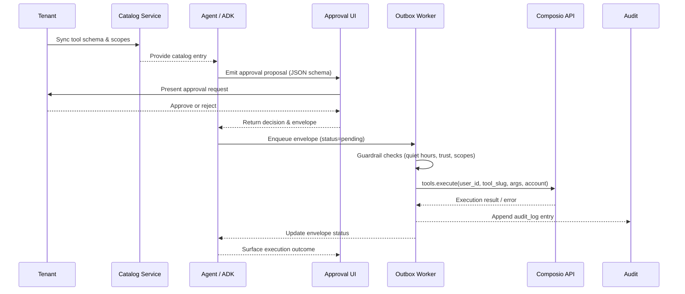

# Composio Execution Layer

**Status:** Planned (no production integration yet)

ADR-0001 locks the platform to Composio as the only mechanism for executing actions on
third-party SaaS apps. This document provides the contract for implementing that
integration end-to-end.

## Responsibilities

1. **Catalog sync** – pull toolkits, schemas, scopes, and risk metadata per tenant.
2. **Connected account lifecycle** – initiate OAuth, poll for activation, disable, and
   re-authenticate accounts.
3. **Execution path** – enqueue, execute, and audit calls to `composio.tools.execute`.
4. **Observability** – capture telemetry (latency, success/failure, provider conflicts).

## Reference Material

- `libs_docs/composio_next/python/providers/google_adk/google_adk_demo.py` – example of
  requesting tools and running them inside an ADK agent via `GoogleAdkProvider`.
- `libs_docs/composio_next/python/README.md` – SDK setup instructions.
- `libs_docs/composio_next/README.md` – high-level overview of the Composio platform.

## Proposed Flow

```
FastAPI Catalog Service (planned)
 ├─ GET /tools → returns cached catalog entries per tenant
 ├─ POST /connected-accounts/initiate → returns OAuth URL
 └─ POST /connected-accounts/:id/enable|disable

Scheduler (APScheduler)
 └─ Nightly job: composio.tools.get(...) → persist JSON schema + scopes in Supabase

Agent (google.adk)
 ├─ Discovers tool metadata from catalog
 ├─ Includes required scopes in proposals
 └─ Produces envelope → Outbox

Outbox Worker (planned)
 ├─ Pops envelope, checks guardrails (quiet hours, trust, DNC)
 ├─ Calls composio.tools.execute(user_id, tool_slug, args, connected_account_id)
 └─ Persists outcome + latency + conflict flags

UI
 ├─ Displays schema-driven edit forms using cached JSON schema
 └─ Shows execution result and audit trail
```

### Sequence Overview



## Implementation Checklist

1. **Client bootstrap** – wrap `Composio(provider=GoogleAdkProvider())` in a singleton
   service. Ensure `COMPOSIO_API_KEY` is read from settings.
2. **Catalog persistence** – define Supabase tables for toolkits, tool versions, default
   risk tiers, and connected accounts. Include unique constraints on `(tenant_id, slug)`.
3. **Envelope format** – finalise a JSON structure with:
 ```json
  {
    "tool_slug": "GITHUB__issues.create",
    "args": {...},
    "connected_account_id": "ca_123",
    "risk": "low",
    "trust_context": {...},
    "external_id": "uuid"  // for idempotency
  }
  ```
4. **Execution + retries** – use Tenacity with exponential backoff. Conflicts (409)
   should mark the envelope as `conflict` but not retry per Composio guidance.
5. **Audit trail** – log every attempt with request/response payload (PII scrubbed) in
   the audit table. Surface the latest status in the Activity timeline.
6. **Safety gates** – enforce quiet hours, autonomy thresholds, and scope validation
   before executing. These align with `docs/governance/security-and-guardrails.md`.

### Approval Flow Contract

- Catalog sync writes JSON Schemas to `tool_catalog.schema`. UI surfaces render those
  via the approval scaffolds documented in `docs/implementation/ui-surfaces.md` and the
  shared state contract (`docs/implementation/frontend-shared-state.md`). Payloads must
  conform to `docs/schemas/approval-modal.json` (no additional properties).
- Scope upgrade envelope example:

  ```json
  {
    "envelopeId": "env_123",
    "proposal": {
      "summary": "Request calendar scope upgrade",
      "evidence": [
        "CALENDAR.READ required to sync events",
        "CALENDAR.WRITE needed to update meetings"
      ]
    },
    "requiredScopes": ["CALENDAR.READ", "CALENDAR.WRITE"],
    "approvalState": "pending"
  }
  ```

- Evidence prompt envelope example:

  ```json
  {
    "envelopeId": "env_456",
    "proposal": {
      "summary": "Submit expense report",
      "evidence": [
        "Upload expense receipt",
        "Confirm policy clause"
      ]
    },
    "requiredScopes": [],
    "approvalState": "pending"
  }
  ```

Ensure callback and UI code stay aligned with this contract so approvals can be
rendered without bespoke React components.

Document progress by updating the status header above as you land each milestone.
