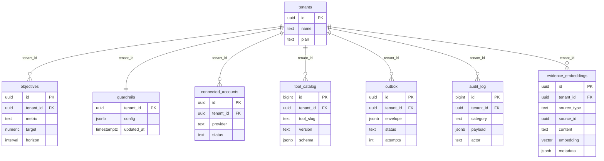

# Data & Roadmap

**Status:** Implemented (Supabase schema, seeds, Outbox worker) · In progress (Supabase Cron
sync jobs, connected-account lifecycle, AI/Vector capabilities)

The Supabase schema now ships in `db/migrations/001_init.sql` alongside a demo seed in
`db/seeds/000_demo_tenant.sql`. In-memory shims remain for unit tests, but the control
plane defaults to Supabase whenever credentials are provided. Use this document to track
remaining persistence work and the conventions expected for new tables.

## Supabase AI & Vector Capabilities

Supabase provides an integrated AI toolkit built on Postgres and pgvector, enabling
semantic search, embeddings management, and intelligent agent features without external
dependencies:

- **Vector storage** – pgvector extension for storing and querying embeddings at scale
- **Semantic search** – similarity search using cosine distance, inner product, or L2 norms
- **Hybrid search** – combine semantic and keyword (full-text) search in a single query
- **Edge Functions AI API** – generate embeddings using the built-in `gte-small` model
  directly in Edge Functions (no external API calls required)
- **Python client (`vecs`)** – manage unstructured embeddings with a Pythonic interface
- **Integration ecosystem** – works with OpenAI, Hugging Face, LangChain, LlamaIndex

### Planned AI Use Cases

1. **Evidence & signal embeddings** – store tool outputs and evidence as vectors to support
   semantic retrieval and context-aware proposal generation
2. **Guardrail learning** – track approval decisions and embedding-based similarity to tune
   trust thresholds over time
3. **Intelligent search** – enable operators to search audit logs, tool outputs, and
   proposal history by semantic meaning rather than exact keywords
4. **Context augmentation** – inject relevant historical context into agent prompts using
   vector similarity search over past proposals and outcomes

Reference `libs_docs/supabase/llms_docs.txt` (lines 3–200, 48117–48230) for
implementation examples and Edge Functions patterns.

## Supabase REST, Realtime, and Storage Services

Supabase automatically reflects tables and RPCs to REST and Realtime channels. As soon
as new tables or policies land, the following surfaces become available:

- **PostgREST REST API** – served from `https://<project>.supabase.co/rest/v1/`. Use
  service-role keys inside the agent/worker, and rely on RLS to scope tenant data in the
  UI. When exposing UI loaders (e.g., approvals history) prefer Supabase JS client calls
  over bespoke FastAPI routes.
- **Realtime channels** – publish queue depth, approval outcomes, and guardrail changes
  to `outbox:tenant_id`, `approvals:tenant_id`, etc. The frontend can subscribe to these
  channels to keep the Desk and Activity surfaces in sync without waiting for state
  deltas.
- **Storage buckets** – dedicate a `evidence-artifacts` bucket for large files (PDFs,
  spreadsheets) produced during envelopes. Persist the bucket ID in `audit_log.payload`
  so the UI can render download links while respecting signed URL expirations.

Keep REST filters and realtime channel names predictable—mirror table names and include
tenant IDs so authorisation stays simple. Document any bespoke RPCs in
`docs/implementation/composio-tooling.md`.

## Local Development & Supabase CLI

The Supabase CLI (`supabase start`) runs a local Postgres + API + Studio stack. Each
developer should:

1. Install the CLI (`npm i -g supabase` or follow
   `docs/getting-started/setup.md#supabase-cli`).
2. Run `supabase init` once per repo clone to scaffold a local project.
3. Use `supabase start` to boot the stack (mirrors staging). The command outputs REST
   URLs, anon keys, and service role secrets—export them into `.env.local` for Next.js and
   `.env` for the agent.
4. Run migrations with `supabase db push` instead of bespoke SQL scripts when iterating
   locally. CI continues to apply migrations via `uv run supabase db push --linked` once
   we automate the workflow.

Leverage `supabase db remote commit` before shipping schema changes so all migrations are
versioned. Update `docs/operations/runbooks/outbox-recovery.md` with any CLI workflows
required for incident response.

## Auth & RLS Strategy

- **JWT claims** – expect Supabase Auth or an upstream identity provider to embed
  `sub`, `tenant_id`, and `role` claims. Service-role keys (agent/worker) bypass RLS but
  must never be exposed to the browser.
- **Row Level Security** – enable RLS on every table. Use helper policies:
  `tenant_isolation` (checks `tenant_id = auth.jwt() ->> 'tenant_id'`) and
  `service_role_full_access` (for server-side jobs). Document any bespoke policies in
  `docs/governance/security-and-guardrails.md`.
- **Fine-grained scopes** – tie Composio scope approvals to Supabase policies. For
  example, require `scope = 'finance:write'` before allowing inserts into
  `evidence_embeddings` for finance tenants.
- **Auditability** – log all policy changes in `audit_log` (category `auth_policy`). Use
  Supabase Realtime to notify the Activity surface when policies change.

## Target Supabase Schema (Draft)

Below are the starter tables we expect to land in Supabase. The initial DDL lives in
`db/migrations/001_init.sql`; keep future migrations alongside the application so we can
evolve the schema in lock-step with the agent.

### `tenants`
- **Columns:** `id uuid primary key`, `name text`, `plan text`, `created_at timestamptz default now()`, `updated_at timestamptz`.
- **Indexes:** primary key + `create index tenants_plan_idx on tenants(plan)`. 
- **RLS:** enable RLS; policy `select on tenants using (id = auth.uid())` once auth wiring exists.
- **Cross-links:** feeds guardrail defaults (`docs/governance/security-and-guardrails.md`).

### `objectives`
- **Columns:** `id uuid pk`, `tenant_id uuid references tenants(id)`, `title text`, `metric text`,
  `target text`, `horizon text`, `summary text`, timestamps.
- **Indexes:** `create index objectives_tenant_metric_idx on objectives(tenant_id, metric)`.
- **RLS:** tenant-scoped policy reuses `current_tenant_id_uuid()`; service role can insert/update.
- **Cross-links:** aligns with shared state schema (`docs/implementation/frontend-shared-state.md`).

### `guardrails`
- **Columns:** `id uuid pk`, `tenant_id uuid references tenants(id)`, `quiet_hours jsonb`,
  `trust_threshold numeric`, `scopes jsonb`, `require_evidence boolean`, timestamps.
- **Indexes:** `create unique index guardrails_tenant_uidx on guardrails(tenant_id)`.
- **RLS:** tenant owners can select/update their record; service role manages inserts.
- **Cross-links:** maps to guardrail docs (`docs/governance/security-and-guardrails.md`, `docs/implementation/backend-callbacks.md`).

### `connected_accounts`
- **Columns:** `id uuid pk`, `tenant_id uuid references tenants(id)`, `provider text`, `status text`, `scopes text[]`, `linked_at timestamptz`, `metadata jsonb`.
- **Indexes:** `create index connected_accounts_tenant_provider_idx on connected_accounts(tenant_id, provider)`.
- **RLS:** tenant owners can read/write their rows; Composio sync runs via service role.
- **Cross-links:** matches Composio integration guide (`docs/implementation/composio-tooling.md`).

### `tool_catalog`
- **Columns:** `id bigserial pk`, `tenant_id uuid references tenants(id)`, `tool_slug text`,
  `display_name text`, `description text`, `version text`, `risk text`, `schema jsonb`,
  `required_scopes text[]`, `updated_at timestamptz`.
- **Indexes:** `create unique index tool_catalog_tenant_slug_version_idx on tool_catalog(tenant_id, tool_slug, version)`.
- **RLS:** tenants can select their entries; the service role (catalog sync job) performs inserts/updates.
- **Cross-links:** forms the backing store for schema-driven UI (`docs/implementation/frontend-shared-state.md`).

### `outbox`
- **Columns:** `id uuid pk`, `tenant_id uuid references tenants(id)`, `tool_slug text`,
  `arguments jsonb`, `connected_account_id text`, `risk text`, `external_id text`,
  `trust_context jsonb`, `metadata jsonb`, `status text`, `attempts integer`,
  `next_run_at timestamptz`, `last_error text`, timestamps.
- **Indexes:** `create index outbox_tenant_status_idx on outbox(tenant_id, status)` and
  `create unique index outbox_external_id_uidx on outbox(external_id)`.
- **RLS:** tenants can read their queue; the agent/worker (service role) performs
  inserts and updates.
- **Cross-links:** supports worker contract (`#outbox-worker-contract` below).

### `outbox_dlq`
- **Columns:** `id uuid pk`, `tenant_id uuid references tenants(id)`, `tool_slug text`,
  `arguments jsonb`, `connected_account_id text`, `risk text`, `external_id text`,
  `trust_context jsonb`, `metadata jsonb`, `status text`, `attempts integer`,
  `last_error text`, `created_at`, `moved_at`.
- **Indexes:** `create index outbox_dlq_tenant_idx on outbox_dlq(tenant_id, moved_at desc)`.
- **RLS:** tenants can read their DLQ entries; the worker (service role) manages inserts/deletes.

### `audit_log`
- **Columns:** `id bigint generated always as identity primary key`, `tenant_id uuid`, `actor_type text`, `actor_id text`, `category text`, `payload jsonb`, `created_at timestamptz default now()`.
- **Indexes:** `create index audit_log_tenant_created_idx on audit_log(tenant_id, created_at desc)`.
- **RLS:** read-only per tenant; writes allowed to service roles to ensure tamper-evidence.
- **Cross-links:** referenced by governance guidance (`docs/governance/ownership-and-evergreen.md`).

### `evidence_embeddings` (planned)
- **Columns:** `id uuid pk`, `tenant_id uuid references tenants(id)`, `source_type text`, `source_id uuid`, `content text`, `embedding vector(384)`, `metadata jsonb`, `created_at timestamptz default now()`.
- **Indexes:** `create index evidence_embeddings_tenant_idx on evidence_embeddings(tenant_id)` and `create index on evidence_embeddings using hnsw (embedding vector_ip_ops)` (HNSW index for fast similarity search).
- **RLS:** tenant-scoped read; service role writes embeddings via Edge Functions or async workers.
- **Purpose:** stores vectorized evidence, tool outputs, and proposal summaries to enable semantic search and context-aware agent prompts.
- **Cross-links:** supports AI use cases in the Supabase AI & Vector Capabilities section above.

### ERD Snapshot

All tables run with Row-Level Security enabled and assume JWTs carry a `tenant_id` claim. 
Adjust policies once authentication wiring is finalised.

## Scheduling & Jobs

Use **Supabase Cron** (managed via the Supabase dashboard or SQL) for all recurring jobs.
Supabase Cron leverages the `pg_cron` extension to schedule jobs that run SQL snippets,
database functions, or invoke Edge Functions with zero network latency. Jobs can run
anywhere from every second to once a year, and all runs are logged in
`cron.job_run_details` for observability.

### Recurring Jobs (Supabase Cron)

- **Trickle refresh** – runs every 30–60 minutes per toolkit category respecting rate
  buckets. Configure via `cron.schedule()` to call an Edge Function that enqueues the
  refresh task into the outbox.
- **Catalog drift monitor** – compares local schema with the latest `composio.tools.get`
  output; raises alerts when drift occurs. Store drift snapshots in `catalog_audit`
  table and expose a REST endpoint for dashboards. Schedule nightly or hourly via
  Supabase Cron.
- **Embedding re-indexer** – nightly job that recalculates embeddings for recent audit
  entries and tool outputs. Kick off via Supabase Cron → Edge Function → worker queue.

### Immediate Triggers (Agent-driven)

For one-off immediate actions (e.g., warm scan after a tenant connects Composio), use
agent-driven task queueing rather than scheduled jobs. The agent can directly enqueue
tasks into the outbox or invoke Edge Functions on-demand.

Track cron definitions in `docs/operations/run-and-observe.md` so on-call engineers know
which schedules exist and how to pause/resume them. Manage jobs via the Supabase
dashboard at **Integrations → Cron** or via SQL using `cron.schedule()` and
`cron.unschedule()`.

## Outbox Worker Contract

- Entry point: `python -m worker.outbox` (referenced in `pyproject.toml`).
- Input: envelopes persisted in the `outbox` table with `status='pending'`.
- Processing rules:
  - Acquire tenant-level locks to avoid double-execution.
  - Check guardrails (quiet hours, autonomy thresholds) before executing.
  - Use Tenacity for retries with a maximum attempt count configurable per risk tier.
  - Write results back to Supabase and emit audit log entries.
- Telemetry: latency histogram, attempt counter, failure counter, conflict counter, and
  dlq size metric.

### Outbox Worker Operations (`worker/outbox.py`)

- **CLI verbs** (`uv run python -m worker.outbox <command>`):
  - `start` – launch the continuous processing loop (use `--once` for a single batch).
  - `status` – output queue depth and DLQ size (optionally scoped to `--tenant`).
  - `drain [--tenant <uuid>] [--limit N]` – requeue DLQ envelopes back into the pending queue.
  - `retry-dlq --tenant <uuid> --envelope <id>` – requeue a specific DLQ envelope after remediation.
- **Telemetry surface** (export via `/metrics` and OTLP):
  - `outbox_processed_total{tenant,status}` – counter with `status=success|retry|failed`.
  - `outbox_processing_duration_seconds` – histogram for envelope latency (p50/p95/p99).
  - `outbox_dlq_size{tenant}` – gauge capturing backlog.
  - `outbox_retry_total{tenant}` – counter for retry attempts.
  - `outbox_processed_per_minute` – derived Prometheus rate used in dashboards.
- **Health checks** (planned additions):
  - `/healthz` – reports healthy when the worker loop is active and Supabase connectivity is verified.
  - `/metrics` – Prometheus endpoint exposing the telemetry above.
  - `status` exit code – non-zero when DLQ backlog exceeds SLO threshold (enables smoke checks in CI/CD).

## Interim Approach

Update this document whenever the data model changes or jobs are added.

The in-memory implementations remain available for unit tests, but production code paths
now default to Supabase. Continue to design interfaces (`CatalogService`,
`ObjectivesService`, `OutboxService`, `AuditLogger`) so additional backends can be added
without refactoring the agent, worker, or UI.
