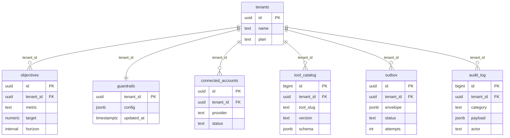

# Data & Roadmap

**Status:** Implemented (Supabase schema, seeds, Outbox worker) · In progress (APScheduler
sync jobs, connected-account lifecycle)

The Supabase schema now ships in `db/migrations/001_init.sql` alongside a demo seed in
`db/seeds/000_demo_tenant.sql`. In-memory shims remain for unit tests, but the control
plane defaults to Supabase whenever credentials are provided. Use this document to track
remaining persistence work and the conventions expected for new tables.

## Target Supabase Schema (Draft)

Below are the starter tables we expect to land in Supabase. The initial DDL lives in
`db/migrations/001_init.sql`; keep future migrations alongside the application so we can
evolve the schema in lock-step with the agent.

### `tenants`
- **Columns:** `id uuid primary key`, `name text`, `plan text`, `created_at timestamptz default now()`, `updated_at timestamptz`.
- **Indexes:** primary key + `create index tenants_plan_idx on tenants(plan)`. 
- **RLS:** enable RLS; policy `select on tenants using (id = auth.uid())` once auth wiring exists.
- **Cross-links:** feeds guardrail defaults (`docs/governance/security-and-guardrails.md`).

### `objectives`
- **Columns:** `id uuid pk`, `tenant_id uuid references tenants(id)`, `title text`, `metric text`,
  `target text`, `horizon text`, `summary text`, timestamps.
- **Indexes:** `create index objectives_tenant_metric_idx on objectives(tenant_id, metric)`.
- **RLS:** tenant-scoped policy reuses `current_tenant_id_uuid()`; service role can insert/update.
- **Cross-links:** aligns with shared state schema (`docs/implementation/frontend-shared-state.md`).

### `guardrails`
- **Columns:** `id uuid pk`, `tenant_id uuid references tenants(id)`, `quiet_hours jsonb`,
  `trust_threshold numeric`, `scopes jsonb`, `require_evidence boolean`, timestamps.
- **Indexes:** `create unique index guardrails_tenant_uidx on guardrails(tenant_id)`.
- **RLS:** tenant owners can select/update their record; service role manages inserts.
- **Cross-links:** maps to guardrail docs (`docs/governance/security-and-guardrails.md`, `docs/implementation/backend-callbacks.md`).

### `connected_accounts`
- **Columns:** `id uuid pk`, `tenant_id uuid references tenants(id)`, `provider text`, `status text`, `scopes text[]`, `linked_at timestamptz`, `metadata jsonb`.
- **Indexes:** `create index connected_accounts_tenant_provider_idx on connected_accounts(tenant_id, provider)`.
- **RLS:** tenant owners can read/write their rows; Composio sync runs via service role.
- **Cross-links:** matches Composio integration guide (`docs/implementation/composio-tooling.md`).

### `tool_catalog`
- **Columns:** `id bigserial pk`, `tenant_id uuid references tenants(id)`, `tool_slug text`,
  `display_name text`, `description text`, `version text`, `risk text`, `schema jsonb`,
  `required_scopes text[]`, `updated_at timestamptz`.
- **Indexes:** `create unique index tool_catalog_tenant_slug_version_idx on tool_catalog(tenant_id, tool_slug, version)`.
- **RLS:** tenants can select their entries; the service role (catalog sync job) performs inserts/updates.
- **Cross-links:** forms the backing store for schema-driven UI (`docs/implementation/frontend-shared-state.md`).

### `outbox`
- **Columns:** `id uuid pk`, `tenant_id uuid references tenants(id)`, `tool_slug text`,
  `arguments jsonb`, `connected_account_id text`, `risk text`, `external_id text`,
  `trust_context jsonb`, `metadata jsonb`, `status text`, `attempts integer`,
  `next_run_at timestamptz`, `last_error text`, timestamps.
- **Indexes:** `create index outbox_tenant_status_idx on outbox(tenant_id, status)` and
  `create unique index outbox_external_id_uidx on outbox(external_id)`.
- **RLS:** tenants can read their queue; the agent/worker (service role) performs
  inserts and updates.
- **Cross-links:** supports worker contract (`#outbox-worker-contract` below).

### `outbox_dlq`
- **Columns:** `id uuid pk`, `tenant_id uuid references tenants(id)`, `tool_slug text`,
  `arguments jsonb`, `connected_account_id text`, `risk text`, `external_id text`,
  `trust_context jsonb`, `metadata jsonb`, `status text`, `attempts integer`,
  `last_error text`, `created_at`, `moved_at`.
- **Indexes:** `create index outbox_dlq_tenant_idx on outbox_dlq(tenant_id, moved_at desc)`.
- **RLS:** tenants can read their DLQ entries; the worker (service role) manages inserts/deletes.

### `audit_log`
- **Columns:** `id bigint generated always as identity primary key`, `tenant_id uuid`, `actor_type text`, `actor_id text`, `category text`, `payload jsonb`, `created_at timestamptz default now()`.
- **Indexes:** `create index audit_log_tenant_created_idx on audit_log(tenant_id, created_at desc)`.
- **RLS:** read-only per tenant; writes allowed to service roles to ensure tamper-evidence.
- **Cross-links:** referenced by governance guidance (`docs/governance/ownership-and-evergreen.md`).

### ERD Snapshot

All tables run with Row-Level Security enabled and assume JWTs carry a `tenant_id` claim. 
Adjust policies once authentication wiring is finalised.

## Scheduling & Jobs

- **Warm scan** – triggers immediately after a tenant connects Composio; executes read
  tools to hydrate signals and evidence into Supabase.
- **Trickle refresh** – runs every 30–60 minutes per toolkit category respecting rate
  buckets. Store scheduling metadata alongside tool definitions.
- **Catalog drift monitor** – compares local schema with the latest `composio.tools.get`
  output; raises alerts when drift occurs.

## Outbox Worker Contract

- Entry point: `python -m worker.outbox` (referenced in `pyproject.toml`).
- Input: envelopes persisted in the `outbox` table with `status='pending'`.
- Processing rules:
  - Acquire tenant-level locks to avoid double-execution.
  - Check guardrails (quiet hours, autonomy thresholds) before executing.
  - Use Tenacity for retries with a maximum attempt count configurable per risk tier.
  - Write results back to Supabase and emit audit log entries.
- Telemetry: latency histogram, attempt counter, failure counter, conflict counter, and
  dlq size metric.

### Outbox Worker Operations (`worker/outbox.py`)

- **CLI verbs** (`uv run python -m worker.outbox <command>`):
  - `start` – launch the continuous processing loop (use `--once` for a single batch).
  - `status` – output queue depth and DLQ size (optionally scoped to `--tenant`).
  - `drain [--tenant <uuid>] [--limit N]` – requeue DLQ envelopes back into the pending queue.
  - `retry-dlq --tenant <uuid> --envelope <id>` – requeue a specific DLQ envelope after remediation.
- **Telemetry surface** (export via `/metrics` and OTLP):
  - `outbox_processed_total{tenant,status}` – counter with `status=success|retry|failed`.
  - `outbox_processing_duration_seconds` – histogram for envelope latency (p50/p95/p99).
  - `outbox_dlq_size{tenant}` – gauge capturing backlog.
  - `outbox_retry_total{tenant}` – counter for retry attempts.
  - `outbox_processed_per_minute` – derived Prometheus rate used in dashboards.
- **Health checks** (planned additions):
  - `/healthz` – reports healthy when the worker loop is active and Supabase connectivity is verified.
  - `/metrics` – Prometheus endpoint exposing the telemetry above.
  - `status` exit code – non-zero when DLQ backlog exceeds SLO threshold (enables smoke checks in CI/CD).

## Interim Approach

Update this document whenever the data model changes or jobs are added.

The in-memory implementations remain available for unit tests, but production code paths
now default to Supabase. Continue to design interfaces (`CatalogService`,
`ObjectivesService`, `OutboxService`, `AuditLogger`) so additional backends can be added
without refactoring the agent, worker, or UI.
