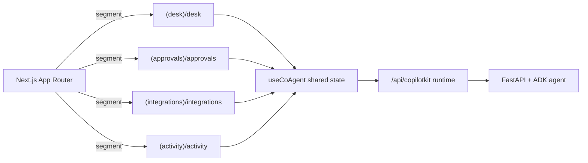

# Frontend Architecture (Next.js + CopilotKit)

**Status:** Implemented (Desk + Approvals scaffolds, runtime bridge) · In progress (Integrations, Activity & Safety, Hire/Roster)

## Current Implementation Snapshot

- **App router** – `src/app/layout.tsx` wires CopilotKit providers and global styles.
- **Demo surface** – `src/app/page.tsx` showcases three CopilotKit primitives:
  - `useCopilotAction` for invoking UI-affecting actions from the agent
  - `useCoAgent` for shared state (the `proverbs` list)
  - `CopilotSidebar` (from `@copilotkit/react-ui`) for the chat experience
- **Runtime endpoint** – `src/app/api/copilotkit/route.ts` creates a `CopilotRuntime`
  backed by an `HttpAgent("http://localhost:8000")` instance (see
  `libs_docs/copilotkit_docs/adk/quickstart.mdx`).

The sidebar defaults to always-open for easier debugging. Copy the ergonomics when
crafting future surfaces.

## Planned Route Layout & Surfaces (Five)

All product surfaces will live under App Router segment groups so layouts, loaders, and
providers stay isolated per surface.

| Route segment | Purpose | Shared state slice | Notes |
|---------------|---------|--------------------|-------|
| `src/app/(workspace)/desk/page.tsx` | Primary queue of proposals surfaced by the agent | `desk.queue`, `desk.metrics` | Scaffolded: streams queue updates via `StateDeltaEvent`s, hydrates from Supabase when available, renders approval shortcuts. |
| `src/app/(workspace)/approvals/page.tsx` | Human-in-the-loop approvals modal + history | `approvalModal`, `approvals.history` | Scaffolded: renders `approval-modal.json` schema-driven forms, persists form state via shared state and emits approve/reject actions. |
| `src/app/(integrations)/integrations/page.tsx` | Connected accounts and scope upgrades | `integrations.accounts`, `integrations.requests` | Surfaces `services.catalog` data and JIT connect/scope upgrades. |
| `src/app/(activity)/activity/page.tsx` | Audit log, DLQ state, guardrail banners | `activity.timeline`, `activity.guardrails` | Consumes `guardrail-state.json` snapshots + audit feed. Supports semantic search over audit logs. |
| `src/app/(workspace)/hire/page.tsx` | Hire wizard + roster & assignments | `roster.list`, `assignments.drawer` | Roster chips (All | A | B | +); per‑program capacity/day sliders; trust chip. |

- Each segment gets its own `layout.tsx` to mount the `CopilotSidebar`, top navigation,
  and surface-specific toolbars.
- Shared components (cards, tables, forms) live under `src/components/` and must remain
  schema-driven; no hard-coded forms per tool.
- Client components should be colocated with the route (`page.tsx`) and rely on
  `useCoAgent` or `useCopilotAction` as described below.

## Design Principles for Product Surfaces

1. **Schema-driven UI** – Render approval forms and tool arguments directly from
   Composio-provided JSON Schema. Avoid bespoke React forms; instead, use components such
   as React JSON Schema Form or CopilotKit generative UI primitives.
2. **State-first rendering** – Every surface derives from shared state (`useCoAgent`) and
   REST data loaders. The agent is the source of truth for queue items, approval modals,
   guardrail banners, and metrics.
3. **Single runtime bridge** – CopilotKit already streams AGUI events over the
   `/api/copilotkit` endpoint. Extend the runtime if additional channels are required
   instead of introducing bespoke websockets.
4. **UX polish** – The Copilot sidebar is necessary but not sufficient. Provide
   evidence-first cards, edit affordances, and human override buttons in the main panel.
5. **Accessibility + performance** – Maintain WCAG AA contrast, keep bundle splits per
   segment, and avoid blocking rendering on runtime events.

## Shared State & Schema Contracts

- Canonical schema files live in `docs/schemas/` and must be referenced by both the
  agent and the UI:
  - `docs/schemas/desk-state.json` → `DeskState` TypeScript type → `agent/services/state.py`.
  - `docs/schemas/approval-modal.json` → approval modal renderer props.
  - `docs/schemas/guardrail-state.json` → guardrail banners and trust status widgets.
- Shared state slices initialise via `useCoAgent` with deterministic defaults; updates
  now arrive via `StateDeltaEvent`s emitted whenever the callbacks mutate `desk`,
  `approvalModal`, `guardrails`, or `outbox` (see `agent/services/state.py`).
- Long-lived state (queue, approvals history) persists via Supabase once the persistence
  layer lands. The agent should load persisted data and emit it as part of the initial
  state so the UI stays optimistic.
- Forms and tables must be generated from JSON Schema and metadata stored in the catalog
  service. Do not handcraft React component trees per tool or approval type.

## Runtime Bridge & Data Fetching

- `src/app/api/copilotkit/route.ts` remains the single runtime bridge to the Python
  agent. Place authentication checks, logging, and tracing middleware here.
- Surface-specific REST endpoints (e.g. `src/app/api/desk/queue/route.ts`) should serve
  initial data for server components and delegate mutations back to the agent via
  actions (`useCopilotAction`) or Supabase RPCs once available.
- Cache schema responses using Next.js `revalidateTag` or `fetch` cache controls so the
  UI boots quickly even if the agent has not streamed state deltas yet.
- Never bypass the agent for business logic decisions—the REST layer may hydrate data,
  but guardrails and approvals continue to flow through shared state.

## Planned Work

| Surface | Purpose | Status |
|---------|---------|--------|
| Desk | Show queued proposals with evidence + quick actions | Planned (requires `desk-state.json` + Supabase queue) |
| Approvals | Schema-driven edit + approve/reject flows | In progress (catalog + envelope schema landed) |
| Integrations | Connected-account lifecycle + catalog inspection | Planned (blocked on Composio OAuth wiring) |
| Activity & Safety | Audit log, DLQ, guardrail controls | Planned (blocked on audit log + worker telemetry) |
| Hire/Roster | Roster, autonomy, assignments drawer | Planned |

Implementation recipes live in `docs/implementation/frontend-shared-state.md` and
`docs/implementation/ui-surfaces.md`.

## Verification & Testing Expectations

- **Playwright smoke tests** – reference implementations live in
  `libs_docs/copilotkit_examples/tests/`. They cover sidebar boot, desk queue render,
  schema-driven approval submit/cancel, and guardrail banner visibility.
- **Component tests** – use React Testing Library to validate schema-driven forms render
  correctly when pointed at the JSON schema fixtures.
- **Manual UX pass** – run `pnpm dev` alongside `uv run python -m agent` and confirm each
  surface renders with seeded demo state before landing PRs.
